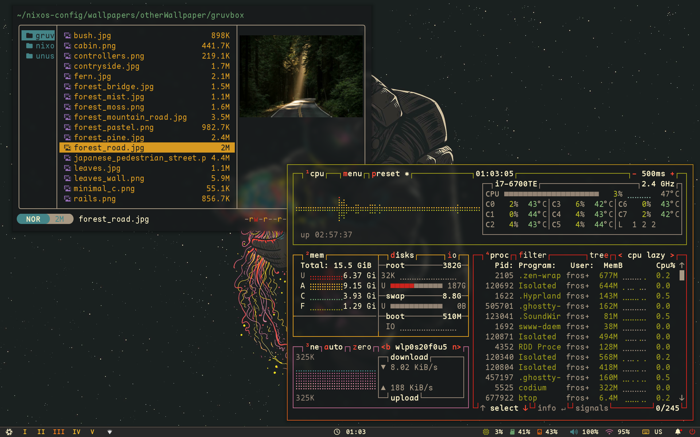

# ❄️ Cactuz's Nix Flakes ❄️

 

## 🛠 Installation

To set up these dotfiles on your own machine, follow the steps below:

### Requirements

- 💻 **Operating System**: [NixOS]
- 🧑‍💻 **Prerequisites**: [A minimal NixOS installation]

### Steps

1. Temporarily install git
   ```bash
   nix-shell -p git
   ```

2. Clone the repository:
   ```bash
   git clone https://github.com/Qwacktuz/nixos-config.git
   ```

3. Read and run the setup script:
   ```bash
    ./install.sh
   ```

4. Reboot & enjoy!

---

### Credits

These flakes were based on . It provided a great starting point for my own nix flakes :)
